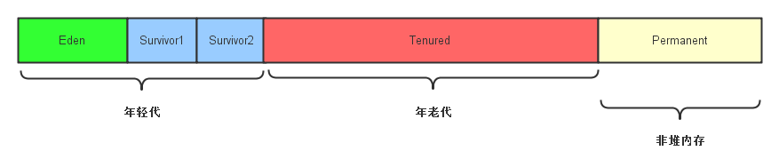

### JVM相关

#### 1.分代GC原理

* 基于事实：不同的对象的生命周期是不一样的
* 代际划分示意图：

* 年轻代 minor GC
* 年老代 major GC
    * Parallel Scavenge(PS)
    * Concurrent Mark Sweep(CMS)

#### 2.GC收集器

##### CMS收集器

* 全称Concurrent Mark Sweep
* 获取最短停顿时间为目标的收集器
* 基于**标记-清除**算法
* 分四步：
    * 初始标记initial mark
        * 标记GC roots可达的老年代对象
        * 遍历新生代，标记可达的老年代对象
    * 并发标记 concurrent mark
    * 重新标记 remark
    * 并发清除 concurrent sweep    

#### 3.JVM常用调优命令
````
-Xms2g：初始化推大小为 2g；
-Xmx2g：堆最大内存为 2g；
-XX:NewRatio=4：设置年轻的和老年代的内存比例为 1:4；
-XX:SurvivorRatio=8：设置新生代 Eden 和 Survivor 比例为 8:2；
–XX:+UseParNewGC：指定使用 ParNew + Serial Old 垃圾回收器组合；
-XX:+UseParallelOldGC：指定使用 ParNew + ParNew Old 垃圾回收器组合；
-XX:+UseConcMarkSweepGC：指定使用 CMS + Serial Old 垃圾回收器组合；
-XX:+PrintGC：开启打印 gc 信息；
-XX:+PrintGCDetails：打印 gc 详细信息。
````

#### 4.Java四大引用类型

* 强引用：发生 gc 的时候不会被回收。
* 软引用：有用但不是必须的对象，在发生内存溢出之前会被回收。
* 弱引用：有用但不是必须的对象，在下一次GC时会被回收。
* 虚引用（幽灵引用/幻影引用）：无法通过虚引用获得对象，用 PhantomReference 现虚引用，虚引用的用途是在 gc 时返回一个通知。

#### 5.JVM运行时数据区
* 程序计数器
* 虚拟机栈
* 本地方法栈
* Java堆
* 方法区

#### 6.JVM模块
* 类加载器
